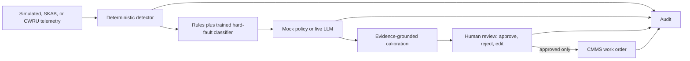

# PM Triage

Predictive-maintenance triage with deterministic detection, an auditable fault-
signature layer, optional LLM explanation, calibrated abstention, a mandatory
human decision, CMMS work-order write-back, and a full audit trail.

## What is actually implemented



- Eight simulated assets plus SKAB pump and CWRU bearing testbeds: eight real
  replay episodes in the current suite.
- Fixed engineering limits and a robust rolling median/MAD detector.
- Auditable cross-signal trends plus a production Extra Trees classifier whose
  single job is the hard SKAB suction-vs-discharge restriction decision.
- A learned IsolationForest novelty gate, feature-roster OOD guard, calibrated
  class probability, and explicit abstention.
- An optional OpenRouter LLM for explanation, precedent use, and recommended
  actions. The free deterministic policy follows the same tool protocol.
- Confidence grounded in precedents and signature agreement. Ambiguous signal
  signatures are capped below the abstention threshold and routed to human
  uncertainty review.
- Formula-based P1–P4 priority, mandatory planner approval, idempotent CMMS
  write-back, and append-only audit events.

## Current measured position

Fresh runs on 2026-07-19, after the evaluation fixes:

| Dataset | Method | Overall top-1 | Coverage | Accuracy when it speaks |
|---|---|---:|---:|---:|
| 24 synthetic faults | deterministic signature | 75.0% | 79.2% | 94.7% |
| 24 synthetic faults | full mock triage | 83.3% | 79.2% after confidence gate | 89.5% |
| 8 real episodes / 2 testbeds | rules + trained layer | 87.5% | 87.5% | 100.0% (7/7) |
| 8 real episodes / 2 testbeds | full mock triage | 87.5% | 87.5% after confidence gate | 100.0% (7/7) |
| 8 real episodes / 2 testbeds | live DeepSeek triage | 87.5% | 75.0% after confidence gate | 100.0% (6/6) |

On real data the safe system abstains on the one cavitation recording and is
correct on the seven cases it accepts. That is a strong development result, not
a production guarantee: the sample remains tiny, and CWRU is a constructed
healthy→fault replay from real steady-state recordings.
The fresh live run used `deepseek/deepseek-v4-flash` for all eight real cases:
34 provider requests, 0 errors, 32.17 seconds mean latency, and **$0.014535**
exact OpenRouter-returned cost. DeepSeek matched the classifier's 7/8 raw
top-1, but abstained on two cases after calibration; the classifier answered
seven and was correct on all seven. Use the classifier for numeric fault
decisions and DeepSeek for explanation, retrieval, and drafting.

See [Evaluation guide](docs/EVALUATION_GUIDE.md) for every metric in plain
language and [Current status](docs/CURRENT_STATUS.md) for done versus pending.

## Cost-safe LLM behavior

Production is free by default even when an API key exists:

- `LLM_MODE=mock` is explicit in `render.yaml`.
- `SPONTANEOUS_FAULT_PROB=0`; paid triage is not triggered by random demo faults.
- Live mode requires the authenticated UI toggle or `LLM_MODE=live`.
- Default live model: `deepseek/deepseek-v4-flash` through OpenRouter.
- `LLM_DAILY_CALL_CAP=12` counts actual provider requests, not cases.
- `LLM_DAILY_USD_CAP=0.25` caps returned OpenRouter cost.
- Every request stores prompt tokens, output tokens, status, and exact cost in
  `llm_calls`.
- `LLM_MAX_OUTPUT_TOKENS=700` bounds each response.
- When either cap is reached or the provider fails, the case continues in free
  deterministic mode and records the fallback in its trace.

Use `openai/gpt-4o-mini` as the fallback model if DeepSeek tool behavior fails
your live smoke test. Full GPT-4o is not the budget option.

## Run locally

```bash
cd backend
python3.11 -m venv .venv
.venv/bin/pip install -r requirements.txt
cp .env.example .env
.venv/bin/uvicorn app.main:app --reload
```

```bash
cd frontend
npm ci
NEXT_PUBLIC_API_URL=http://localhost:8000 npm run dev
```

The default mode is deterministic and needs no API key.

## Verify

```bash
cd backend
.venv/bin/python -m pytest -q
.venv/bin/python -m app.eval --trials 24 --mode mock
.venv/bin/python -m app.eval --data replay --trials 8 --mode mock
```

Current verification: **105 backend tests pass** and `npm run build` completes.

## Deployment

- Next.js frontend: Vercel.
- FastAPI backend: Render.
- Production database: Supabase Postgres through SQLAlchemy, in the
  `pm_triage` schema.
- Local/test database: SQLite.
- `.github/workflows/keep-warm.yml` sends a health request every ten minutes to
  reduce Render free-tier cold starts. It does not run triage or spend LLM
  tokens.

Deployment-affecting changes in this working tree are not live until they are
reviewed, committed, pushed, and the services redeploy.

## Documentation

- [FDE assessment defense master guide](docs/FDE_DEFENSE_MASTER_GUIDE.md)
- [Complete code and data-flow reference](docs/CODE_AND_DATA_FLOW_REFERENCE.md)
- [Production challenge questions and answers](docs/PRODUCTION_CHALLENGE_QA.md)
- [Documentation index](docs/README.md)
- [Current status and honest claims](docs/CURRENT_STATUS.md)
- [Evaluation numbers in simple language](docs/EVALUATION_GUIDE.md)
- [Backend flow, schemas, mappings, tools, mock vs live](docs/ARCHITECTURE_AND_INTERVIEW_GUIDE.md)
- [LLM cost controls and model choice](docs/COST_CONTROL.md)
- [Trained classifier, OOD calibration, and the rejected predecessor](docs/ML_EXPERIMENT.md)
- [Interview defense pack](docs/DEFENSE_PACK.md)
