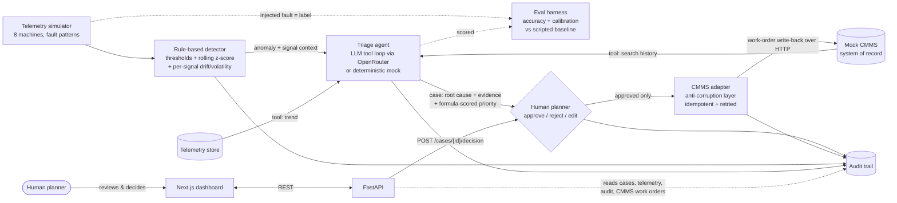

# PM Triage — Predictive Maintenance Triage Assistant

FDE assessment artifact for **Challenge 8.3 (Manufacturing)**: reduce unplanned
downtime by improving how maintenance tickets are triaged. See `CONTEXT.md` for
the full decision log and rationale.

**Grounded in real data:** the fleet includes a machine whose telemetry is not
simulated at all — `PMP-03` replays **real recordings from the SKAB pump
testbed** ([Skoltech Anomaly Benchmark](https://github.com/waico/SKAB),
GPL-3.0): physically induced rotor imbalance, cavitation, and valve-restriction
experiments, with the dataset authors' per-row anomaly labels riding along as
evaluation ground truth. Real data forced a real design change: the testbed
runs at a different operating point in every recording, so fixed thresholds are
blind there — detection gained a second deterministic rule, a **robust z-score
(median/MAD) sustained over consecutive readings** against the machine's own
rolling baseline. Telemetry is signal-generic (each machine carries its own
tag roster with units, like a real historian), and the demo lever on the real
machine *cues the actual recording* just before its labelled fault window —
nothing is synthesized.

**What it does:** simulated IoT telemetry streams from an 8-machine fleet →
a deterministic, explainable anomaly detector flags excursions → an AI agent
investigates each anomaly with tools (machine catalog, telemetry trend,
historical work-order search against a mock legacy CMMS) → it produces a triage
case: likely root cause, confidence, evidence citations, recommended actions,
and a P1–P4 priority from a transparent scoring formula → a **human planner
approves / rejects / edits every case** → an approval is **written back to the
CMMS system of record as a work order** through an anti-corruption adapter →
every step lands in an audit trail.

The loop is closed both ways: the agent **reads** history from the system of
record to reason, and an approved decision is **written back** to it as an
action — with a human in the middle and never any direct machine control.

## Architecture



Design positions that matter:

- **Detection is not the LLM.** Thresholds + z-scores are deterministic, cheap,
  and quotable to a technician. The LLM starts where judgment starts: root-cause
  correlation against history.
- **Priority is a formula, not vibes.** criticality + severity + recurrence +
  safety flag → P1–P4, shown component-by-component in the UI. The agent may
  propose a ±1 notch with written justification; it can never downgrade a P1.
- **A breach names one metric; the pattern across signals names the fault.**
  Detection reports drift/volatility/range for every metric, deterministically —
  rising vibration alone cannot tell wear from cavitation, but pressure sitting
  still versus swinging 9% can. The planner sees the same table.
- **The confidence is measured, not asserted.** See the evaluation harness
  below: the agent is right 77.4% of the time when it claims 75.5%.
- **The human gate is structural.** A case is born `pending_review` and only a
  `POST /api/cases/{id}/decision` (with reviewer name) moves it. Decisions are
  final (409 on re-decision) and fully audited with before/after diffs.
- **The loop closes into the system of record.** An approved case is translated
  by an **anti-corruption adapter** into the CMMS's own schema (SAP PM notification
  fields, ISO 14224 damage codes, priority 1–4) and written back over HTTP as a
  work order. The write-back is **idempotent** (one work order per case, so a
  retry or double-click never double-raises) and **retried with backoff**; if the
  CMMS is down the human decision still stands and the sync is deferred and
  retryable (`POST /api/cases/{id}/sync-cmms`; a retry that still fails answers
  502, and a CMMS 4xx rejection is a terminal `rejected` status — replaying a
  bad payload is refused with 409). The CMMS is a separate service —
  swap its `CMMS_BASE_URL` for real SAP PM / Maximo and only the adapter changes.
- **Priority carries a money figure.** Each case shows the business exposure
  (`expected downtime × the asset's hourly downtime cost`) alongside P1–P4 —
  informational, deliberately not folded into the governance score.
- **Demo resilience.** `LLM_MODE=mock` runs the identical tool-loop protocol
  with a scripted policy — the demo works with no key, no network.

## Run locally

```bash
# backend (Python 3.11)
cd backend
pip install -r requirements.txt
cp .env.example .env            # add OPENROUTER_API_KEY for live LLM mode
uvicorn app.main:app --reload   # http://localhost:8000

# frontend
cd ../frontend
npm install
NEXT_PUBLIC_API_URL=http://localhost:8000 npm run dev   # http://localhost:3000
```

Tests: `cd backend && python -m pytest tests` (detector rules, mock-agent
end-to-end, priority formula, human-gate finality, scorer calibration, label
containment, CMMS adapter translation + retry + idempotency, the
approve→write-back loop, and the access gate + LLM spend cap). 74 tests.

Governance controls in the deployment:

- **Access gate** — `APP_ACCESS_PASSWORD` protects every state-changing route;
  reviewers sign in with their own name, which signs their decisions in the
  audit trail (the token identity wins over anything in the request body).
  Reading the dashboard stays open: a shared link shows, it cannot act.
- **LLM spend control** — the deployed default is the free deterministic mock;
  a **live/mock toggle in the header** (auth-required, audited) switches the
  real model on for a demo, and `LLM_DAILY_CALL_CAP` hard-caps live runs per
  UTC day, degrading back to mock rather than stalling the queue.

## Does it actually work? — the evaluation harness

The agent reports a `confidence` and nothing checks it. But the simulator
already knows which fault it injected, so **every anomaly it raises is a free
labelled example** — a labelled dataset that was being thrown away. The harness
turns that label into a measurement:

```bash
cd backend && python -m app.eval --trials 40 --mode both     # mock vs live, synthetic
cd backend && python -m app.eval --data replay --mode mock   # against REAL SKAB labels
```

It drives the real pipeline (real simulator/replayer, real detector, real
agent tool loop) on a machine with a known fault, then scores the case that
comes out. Committed runs: `backend/eval-report.json` (synthetic, 40 trials)
and `backend/eval-report-real.json` (real SKAB episodes). On the current
pipeline (signal-generic detector, noisy realistic CMMS corpus), the mock
scripted baseline detects 100% of both synthetic faults and the 4 real SKAB
fault classes, at 50% top-1 root-cause accuracy on each.

An earlier run of the live model (claude-sonnet-4.5) on the previous pipeline
measured **77.5% vs the then-57.5% mock baseline (+20pp), ECE 0.046, 25.9s
mean latency** — what the LLM buys over a scripted policy, measured rather
than asserted. Re-measure with `--mode live` on the current (harder) pipeline
before quoting those numbers together.

**Confidence is trustworthy, and that is the finding that shapes the product.**
In the 0.70–0.85 band the agent states 75.5% and is right 77.4% (n=31). Above
0.85 it states 86% and is right 100% — it is *under*-confident, not over. So the
human gate is not a philosophical stance, it is a threshold that can be argued
from data: this is the band where the agent has earned trust, and below it a
planner must look.

### What the harness found

Live cavitation scored **25%** — every case called bearing wear. Not a retrieval
failure: the agent cited WO-1007, the cavitation work order, in *all four*
trials. It had the precedent and no way to choose it. Both faults present as
rising vibration, and the detector reported only the breaching metric, so the
pressure instability that separates them never reached the agent. No prompt
fixes an absent signal.

The detector now reports drift, volatility and range for every metric. The
shapes separate cleanly (PMP-01, pressure): wear drifts +3.1 at 1.1%
volatility; cavitation +15.0 at 9.3%; a leak marches −37.4. **Cavitation went
25% → 100%.**

### How the scoring works, and how it is checked

Two scorers that share no logic: one reads the agent's free-text `root_cause`,
one reads its cited work-order ids through a curated signature map
(`app/eval/taxonomy.py`). The harness reports their **agreement (89.7%)**, so
the measuring instrument is checked and not just the agent — and it earned that
twice. The scorers disagreed on WO-1011 and the text scorer was wrong; they
disagreed again and it was the *citation* scorer reading the CMMS search
ranking instead of the agent's own ordering. Both were harness bugs that looked
like agent noise.

### Read this before quoting any number

- **The ground truth is synthetic.** This measures whether the agent recovers a
  fault the simulator seeded and the CMMS already documents — a friendlier task
  than a real plant, so 77.5% is optimistic. The harness is the deliverable, not
  the number: point it at real CMMS data and the loop is unchanged.
- **Fault classes are symptom signatures, not physical causes.** `bearing_wear`
  means "progressive wear → rising vibration"; on a conveyor that is a worn
  chain, on a spindle a worn bearing. The work-order map encoding that is a
  curated judgement, kept small and auditable in one file.
- **n=40 is small, and per-class n=10 is smaller.** The mock's own score moved
  50.0% → 57.5% between a 16-trial and a 40-trial run *with identical code* —
  that swing is pure sample noise, and it is the yardstick for how much to trust
  any single class figure.
- **Known costs, not swept up.** The pressure signal introduced one false
  cavitation call on a bearing-wear case (1/10). One trial in 40 exhausted the
  8-step tool budget and produced a placeholder at confidence 0.1 — correctly
  low-confidence, but `MAX_STEPS` looks tight; the obvious fix is unmeasured, so
  it is not claimed.

## Demo script (live defense)

1. Open the dashboard — fleet cards stream live telemetry with sparklines.
2. Pick a machine + fault in the top bar, hit **Inject fault (demo)** — e.g.
   `CMP-01` + `overheat`.
3. Within ~15s the detector flags the excursion and the agent files a case in
   the triage queue.
4. Open the case: root-cause hypothesis, cited historical work orders (safety
   flags highlighted), the priority formula, the **business exposure in dollars**,
   the full agent tool trace.
5. Approve, reject, or override the priority — with your name. The case detail
   now shows the **CMMS work order** the approval raised; open the **CMMS tab**
   to see it sitting in the system of record with its translated fields
   (priority code, ISO 14224 damage code, functional location). Then the **audit
   trail** tab: system → agent → human → system, every step attributed — the
   `work_order_created` event follows the human `case_approve`.
6. If asked "what if the LLM is down?" — point at the mock-mode pill; the
   pipeline is identical.
7. If asked "what if the CMMS is down?" — the decision is still recorded and
   audited; the case shows sync-failed with a **Retry CMMS sync** button, and the
   write is idempotent so the retry is safe.
8. If asked "how do you know it works?" — the committed eval reports: 100%
   detection on the real SKAB fault classes and on synthetic faults, a
   scripted-baseline floor at 50% top-1, and the earlier live-model delta
   (+20pp, ECE 0.046). Then volunteer the caveats above; they are the point.
9. If asked "is any of this real?" — open `PMP-03`: real testbed telemetry,
   real induced faults, dataset-author labels, and the detector rule (robust
   z-score) that real operating-point variance forced.

## Deployment (always-on, $0/mo)

The canonical home is the standalone repo **github.com/amarshikhar/pm-triage**.

- **Backend → Render (free):** Blueprint from the repo-root `render.yaml`
  (service `pm-triage-backend`). Environment:
  - `DATABASE_URL` — the Supabase Postgres pooler DSN (Supabase dashboard →
    Connect). Cases, work orders, and the audit trail then **survive
    redeploys**; the app provisions its own `pm_triage` schema on first boot.
  - `APP_ACCESS_PASSWORD` — the crew password (viewing stays open without it,
    acting requires it).
  - `OPENROUTER_API_KEY` + `LLM_DAILY_CALL_CAP` — live-LLM demos, capped.
- **Keep-warm:** `.github/workflows/keep-warm.yml` pings the API every 10
  minutes so the free instance ~never spins down (and the traffic keeps the
  free Supabase project active). Best-effort, not contractual — warm the URL
  before a live demo anyway.
- **Frontend → Vercel:** project with Root Directory `frontend`,
  `NEXT_PUBLIC_API_URL` pointed at the Render URL.

## Tech stack declaration

- **Languages/frameworks:** Python 3.11, FastAPI, SQLAlchemy, Pydantic;
  TypeScript, Next.js 14 (App Router), hand-rolled SVG charts (no chart lib).
- **AI/LLM:** Claude Sonnet 4.5 via OpenRouter (OpenAI-compatible tool calling),
  model overridable via `OPENROUTER_MODEL`; deterministic mock mode for
  offline/eval runs.
- **Infra/data:** Supabase Postgres in production (SQLite for local/test) via
  SQLAlchemy, own `pm_triage` schema, telemetry retention pruning; simulated
  IoT feed **plus real SKAB testbed recordings** (curated GPL-3.0 episodes,
  committed); mock CMMS system of record; Render (API) + Vercel (UI); pytest.
- **Integration:** the CMMS is a separate ASGI service (its own schema/datastore)
  reached only over HTTP through an anti-corruption adapter (httpx); write-back is
  idempotent (`Idempotency-Key`) and retried with backoff. `CMMS_BASE_URL` repoints
  the same adapter at a networked CMMS (e.g. SAP PM) with no other change.
- **Evaluation:** in-repo harness scoring the agent against simulator ground
  truth — accuracy, per-class confusion, confidence calibration + ECE, and a
  live-vs-scripted delta. Two independent scorers cross-check each other.

## Live

- UI: https://pm-triage.vercel.app
- API: https://pm-triage-backend.onrender.com/api/health

The API runs on Render's free tier with a keep-warm ping and Supabase Postgres
persistence: the link stays warm around the clock and decisions survive
redeploys. If the keep-warm lapses (free tier is best-effort), first hit takes
~50s — warm the URL before a live demo.
