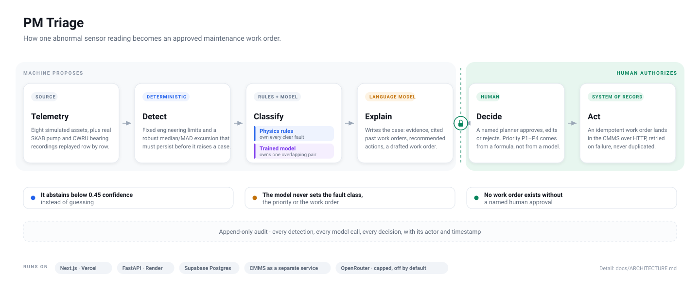

# Architecture

One abnormal sensor reading moves left to right. Everything left of the gate is
a proposal; nothing right of it happens without a person. The colour of a box
says who is responsible for it: blue is deterministic code, violet is the
trained model, amber is the language model, green is human authority.

## Who decides what

The diagram is really one table. Each decision has exactly one owner, and no
owner can quietly take another's job.

| Decision | Owner | Where it lives |
|---|---|---|
| Is this reading abnormal? | Deterministic code | `backend/app/detector.py` |
| What kind of fault is it? | Physics rules first; a narrow trained model for the one overlapping pair | `backend/app/classifier.py`, `backend/app/ml_classifier.py` |
| Is the evidence strong enough to answer at all? | Calibration, against precedent and signature agreement | `backend/app/agent/calibration.py` |
| How is it explained, and what work is proposed? | The language model — mock policy or live provider, same tool protocol | `backend/app/agent/triage.py`, `backend/app/agent/llm.py` |
| How urgent is it? | A published formula. The agent may move it one notch, with a written reason, and can never downgrade a P1 | `backend/app/priority.py` |
| Does any work actually happen? | A named human | `POST /cases/{id}/decision` in `backend/app/routes.py` |
| Where does approved work land? | The CMMS, over HTTP, idempotently | `backend/app/agent/cmms_adapter.py`, `backend/app/cmms/service.py` |

## What runs where

## Why the boundaries sit where they do

**Detection is deterministic.** Fixed engineering limits plus a robust rolling
median/MAD excursion that has to persist. A technician can read the rule that
fired, and the same reading always produces the same result.

**The trained model is deliberately narrow.** It has one job: separating
suction from discharge restriction on the SKAB pump, the pair that physics
rules cannot cleanly split. An IsolationForest novelty score and an exact
feature-roster check make it abstain on anything outside that job rather than
answer confidently in a domain it was never trained on.

**The language model never decides.** It retrieves precedent, explains the
evidence, and drafts the work order. Fault class, priority, and the existence
of a work order are all owned elsewhere, so a fluent wrong answer costs an
explanation, not a maintenance action.

**Confidence is grounded, not self-reported.** A model's own certainty tracks
fluency. The calibrated number is built from matching precedent and signature
agreement, and below 0.45 the case is flagged as one the system will not answer
— it still reaches a planner, marked as uncertain.

**The human gate is structural.** A work order is created in one place, after
one transition, by a request that carries a bearer token and a reviewer name.
There is no autonomous path from telemetry to action, by construction.

**The CMMS is a separate service, not a function call.** The triage backend
reaches it over HTTP with an idempotency key and a retry, exactly as it would
reach SAP or Maximo. Repointing `CMMS_BASE_URL` swaps the system of record
without touching anything above that line.

**Spending is opt-in.** `LLM_MODE=mock` is the deployed default even when an
API key is present — a credential is not permission to spend. Live mode is
capped at 12 provider calls and $0.25 per day with 700 output tokens per call,
every call is costed into `llm_calls`, and hitting a cap or a provider failure
drops the case back to the free deterministic policy and records that in its
trace.

## What these diagrams do not claim

- Eight real replay episodes across two laboratory testbeds do not establish
  production accuracy. The CWRU sequences are constructed from real steady-state
  recordings, not natural fault onsets.
- The trained layer is complete only for the restriction pair it was built for.
- Boxes describe the code in this repository; deployment-affecting changes are
  live only once pushed and redeployed.

Measured numbers live in [Evaluation guide](EVALUATION_GUIDE.md) and
[Current status](CURRENT_STATUS.md). The line-by-line walkthrough is in
[Code and data-flow reference](CODE_AND_DATA_FLOW_REFERENCE.md).

Both diagrams are plain SVG in [`diagrams/`](diagrams) — readable text, edited
in place, with no build step and no external assets.

## Click through it

[`diagrams/architecture-interactive.html`](diagrams/architecture-interactive.html)
is the same content as a single self-contained page you step through: four
flows — fault triage, the human decision, an abstention, and live-model spend —
with the payload at each step, a mock/live toggle, and a dark/light theme.
Clone and open it in a browser; GitHub will not render it inline.

Built from the [architecture-diagram
skill](https://github.com/konraddzbik/architecture-diagram-skill) (MIT).
