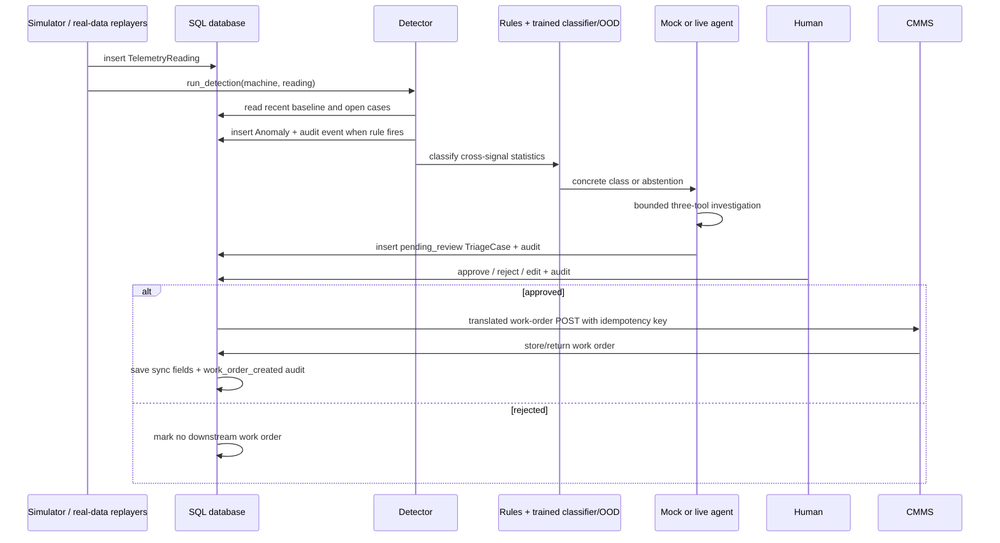

# Architecture and interview guide

## The application in one sentence

Machine readings enter the backend; deterministic code detects an abnormal
pattern and proposes a fault signature; a mock policy or live LLM investigates
using three read-only tools; calibration can abstain; a human approves, rejects,
or edits; approval alone creates a CMMS work order; every important transition
is recorded.

## Technology words in simple language

### API

An API is a defined way for one program to ask another program for data or an
action. For example, the browser asks `GET /api/cases/12` for case 12 and sends
`POST /api/cases/12/decision` when a planner decides it.

### REST API

REST is a common HTTP style:

- `GET` reads something.
- `POST` creates something or triggers an action.
- A URL names the resource, such as `/api/machines` or `/api/cases/12`.
- JSON is the request/response body.
- Status codes communicate outcomes: 200 success, 401 not signed in, 404 not
  found, 409 conflicting/final decision, 422 invalid input, 502 downstream CMMS
  unavailable.

### FastAPI

FastAPI is the Python web framework that exposes those REST endpoints. It maps a
URL to a Python function, validates incoming bodies with Pydantic, injects a
database session, and serializes the return value to JSON. It also serves the
OpenAPI schema automatically.

### Next.js

Next.js is the TypeScript/React framework for the browser interface. It renders
the Fleet, Machine, Cases, CMMS, Audit, and Evaluation pages, calls the FastAPI
REST endpoints, and updates the UI as fresh data arrives. It does not run the
detector or make model decisions.

### Render

Render hosts the Python/FastAPI backend. `render.yaml` tells it how to install
Python packages, start Uvicorn, and set safe environment defaults.

### Vercel

Vercel hosts the Next.js frontend. The frontend's
`NEXT_PUBLIC_API_URL` points it to the Render API.

### pytest

pytest runs automated Python tests. The suite checks detector rules, signature
classification, calibration, the agent tool loop, authentication, paid-call
caps, human decisions, CMMS translation/retry/idempotency, and evaluation logic.
Current result: 99 passing backend tests and a successful Next.js production build.

### Dockerfile

`backend/Dockerfile` is a repeatable recipe for packaging the Python service:
choose a Python base image, install requirements, copy the backend, and start
Uvicorn. Render currently uses its native Python build instructions from
`render.yaml`; the Dockerfile is an alternative portable deployment artifact.

### Supabase Postgres / Postgres

Postgres is the production relational database. Supabase provides the hosted
Postgres instance and connection pooler. The app uses the `pm_triage` database
schema so its tables do not collide with other applications. Supabase is not a
separate logic layer here; it is the durable database service.

### SQLAlchemy

SQLAlchemy is the Python database layer. Classes such as `Machine`, `Anomaly`,
and `TriageCase` map to database tables. The same code works with local SQLite
and production Postgres, which keeps environment changes out of business logic.

### Pydantic

Pydantic validates API inputs. For example, an LLM mode must be `live`, `mock`,
or `auto`; a decision must be `approve`, `reject`, or `edit`; and a CMMS priority
code must be from 1 through 4. Invalid requests are rejected before domain logic
runs.

### TypeScript

TypeScript is JavaScript with type checking. The frontend declares the expected
shape of a `Case`, `Machine`, evaluation report, work order, and LLM budget. It
catches many browser/backend contract mistakes during `npm run build`.

### Live telemetry and sparklines

The backend adds readings on a timer. The frontend polls the API and draws a
small SVG line chart—a sparkline—from recent values. A sparkline is visual
context, not the detector. The detector runs in Python against stored readings.

## Whole backend flow



## How telemetry is generated

### Simulated machines

There are eight simulated machines. Each type has baseline means and noise for
temperature, vibration, pressure, and RPM.

On every tick:

1. Random Gaussian noise creates a normal reading.
2. If a fault is active, deterministic drift is added:
   - `bearing_wear`: vibration rises; temperature also rises slowly;
   - `overheat`: temperature rises;
   - `pressure_loss`: pressure falls;
   - `cavitation`: vibration rises and pressure oscillates.
3. The reading is inserted into `telemetry`.
4. Detection runs immediately.

Manual injection calls `POST /api/simulate/inject` with a machine and fault. It
puts that fault into `simulator.active_faults` and temporarily bypasses duplicate
alert suppression so the demo can produce one fresh case. Deduplication is at
the machine-event level, not the individual-signal level: vibration RMS,
kurtosis, crest factor, and RPM may all move during one bearing episode, but
they remain evidence on one anomaly/case rather than becoming four cases.

Random injection still exists in code for local experiments, but production
sets `SPONTANEOUS_FAULT_PROB=0`. Therefore production faults occur only after an
authorized manual injection. This prevents accidental paid triage.

### Real replay testbeds

`PMP-03` reads five SKAB CSV recordings:

- rotor imbalance;
- cavitation;
- two separate discharge-restriction recordings;
- suction restriction.

Each CSV row contains six signals and a dataset-author label. The label is
stored only as evaluation ground truth; the detector and agent cannot access it.

`BRG-01` reads three CWRU bearing episodes: inner race, ball, and outer race.
The curator verifies four official MATLAB downloads by SHA-256 and turns
0.1-second accelerometer frames into RMS, kurtosis, crest factor, and RPM. Each
episode concatenates a real healthy steady state with a real faulty steady
state. It is a constructed transition for ingestion/detection/OOD evaluation,
not a natural run-to-failure recording. See `backend/data/CWRU_PROVENANCE.md`.

The production loop emits one replay row per `SIM_INTERVAL_S`, currently three
seconds. The source files have roughly one row per original second, so playback
is slower than the original experiment:

- one 923–1,147-row episode takes roughly 46–57 wall-clock minutes at a
  three-second tick;
- all five SKAB files total 5,333 rows, roughly 4 hours 27 minutes for a full cycle.

So it is **not an 18-minute production loop**. The original recordings are about
15–19 minutes each, but the app emits them at one row every three seconds.

The “Cue real fault” control skips to 45 healthy rows before the labelled fault
window. At a three-second tick that is about 135 seconds of honest lead-in for
the 30-reading detector baseline. Sustained detection and triage add more time,
so the UI says about two to three minutes before detection and then waits for
case drafting. The cue response is immediate and the Audit row is written at
that moment.

Detection and triage run on different clocks. Each telemetry/replay tick commits
an anomaly and puts its id onto an in-process triage queue. A single worker
handles the slower classifier/LLM/tool loop in order while the three-second feed
keeps advancing. This prevents a 30–60 second live LLM call from freezing every
machine. The anomaly timestamp therefore means “rules fired”; the later case
timestamp means “triage finished and the case was committed.”

`GET /api/health` also exposes Render's seven-character Git release id. This is
non-secret deployment metadata and lets an operator distinguish “the endpoint
is awake” from “the endpoint is running the commit I just released.”

For a demo, manual injection on `PMP-03` does not synthesize a fault. It calls
`jump_to_fault`, which moves the cursor to 45 rows before the labelled region.
Thirty rows rebuild the detector baseline and 15 rows preserve honest healthy
lead-in. Detection time still varies by episode; the current SKAB eval
needed 42–99 ticks in the current run, about 2.1–5.0 minutes at the production tick. The eval CLI
runs ticks without sleeping, so evaluation completes quickly.

## Detection details

Detection is deterministic and has two independent rules.

### Rule 1: engineering limit

The machine catalog can define a limit and direction. Example: temperature over
92 °C or pressure below 640 kPa. Severity comes from percentage beyond the
limit: low, medium, or high.

### Rule 2: sustained robust excursion

For signals without a reliable fixed limit, the detector compares the current
value to the machine's own recent operating point:

- baseline window: 30 readings;
- center: median;
- spread: median absolute deviation, scaled like standard deviation;
- trigger: magnitude over 4 robust sigma;
- sustain: three consecutive readings.

This matters for SKAB because healthy flow changes substantially between
physical runs.

### Context stored with the anomaly

For every signal, not only the breached one, the detector stores:

- mean;
- drift: later-half mean minus earlier-half mean;
- volatility percentage;
- peak-to-peak range;
- first/last quarter means, delta, percentage delta and linear slope;
- median, MAD and derivative standard deviation;
- number of samples.

This `context_json` is the input to the signature classifier and is also shown
to the planner.

## The current classifier

The classifier is hybrid. `backend/app/classifier.py` contains auditable
physics signatures for clear classes. `backend/app/ml_classifier.py` loads a
trained Extra Trees artifact only for the overlapping SKAB restriction family.

### Feature mapping

Different sensor names are mapped to physical roles:

| Signal key | Physical role |
|---|---|
| `vibration_mm_s`, `vibration_g`, `vibration_rms_g` | vibration |
| `flow_lpm` | flow |
| `pressure_kpa`, `pressure_bar` | pressure |
| `current_a`, `rpm` | load |
| `temperature_c`, `temp_motor_c` | temperature |
| `temp_fluid_c` | fluid temperature |

Drift is normalized against each window's range. Helper features represent
rising, falling, steady, volatile, and materially changed signals.

### Signature examples

- Bearing wear: vibration activity, small temperature rise, steady pressure.
- Overheat: material temperature rise with relatively steady vibration.
- Pressure loss: falling pressure with steady vibration.
- Cavitation: flow instability plus pressure drop/jitter and vibration support.
- Rotor imbalance: vibration activity while flow and pressure stay steady.
- Suction/discharge restriction: shared flow/load fall; pressure direction is
  the weak separator.

The rules rank seven classes and abstain when the best score is below 0.56 or
leads by less than 0.07. On a replay context, the narrow trained layer also
produces auditable routing metadata. If the rules abstain and the context is
in-distribution for restrictions, Extra Trees chooses suction or discharge.

The model uses 72 ordered features: 12 window statistics for each of six SKAB
signals. It was trained on 510 windows from 17 physical experiments; every
validation fold holds out the complete experiment. Isotonic regression
calibrates the discharge probability from out-of-fold predictions.

The artifact also contains an IsolationForest. Its threshold comes from the
10th percentile of leave-one-experiment-out in-distribution novelty scores. A
score below that threshold, low calibrated class confidence, or a mismatched
signal roster means abstain. Full split and metric evidence is in
`ML_EXPERIMENT.md`.

## Mock agent versus live LLM

Both modes use the same tool schemas, tool dispatcher, downstream calibration,
priority formula, case schema, human gate, and CMMS flow.

### Read-only agent tools

1. `get_machine_info(machine_id)` returns id, name, type, location, criticality,
   and signal definitions.
2. `get_recent_telemetry(machine_id, n)` returns recent timestamped readings and
   signal units.
3. `search_maintenance_history(machine_type, keywords, machine_id)` searches
   maintenance logs by term overlap, adds a same-machine boost, and returns up
   to five records with failure mode, symptoms, root cause, action, downtime,
   safety, record type, and match score.

The ground-truth fault label is never included in any tool result.

### Deterministic mock

The mock is free and predictable. It always calls machine info, telemetry, and
maintenance history in that order. It prefers corrective history over routine
records, then builds its answer from the highest-ranked match. It still uses
real database rows and the actual production tool loop; only the language-model
decision policy is scripted.

### Live LLM

The live model receives:

- system rules;
- anomaly description and severity;
- machine identity, type, criticality, and location;
- computed cross-signal context;
- the signature prior or signature abstention explanation.

The model chooses tool calls and eventually returns JSON containing root cause,
raw confidence, explanation, recommended actions, cited work orders, and a
proposed priority adjustment. The loop allows at most eight model turns.

Every paid turn is reserved in `llm_calls` before sending. The returned usage
updates exact tokens and cost. Failure or cap exhaustion restarts the free mock
loop and records why in the trace.

If a provider emits malformed JSON tool arguments, the backend does not guess
what it meant and does not drop the case. It records `invalid_tool_arguments`,
returns a structured tool error, and gives the model another turn within the
same eight-step bound. This behavior is covered by a regression test from the
paid DeepSeek replay.

## How a case is created

The backend combines different owners rather than trusting one component:

| Case part | Owner / mapping |
|---|---|
| anomaly value, threshold, z-score, severity | deterministic detector |
| signal context | deterministic detector statistics |
| class prediction/ranking/OOD evidence | deterministic rules + narrow trained classifier |
| precedent, explanation, actions, citations | mock policy or live LLM |
| operational root cause | concrete classifier class when available; otherwise LLM draft under abstention gate |
| recurrence count | count of earlier same-machine/same-metric cases |
| priority base | deterministic formula |
| ±1 adjustment | agent proposal, clamped; P1 cannot be downgraded |
| confidence and abstention | deterministic calibration |
| downtime estimate | maximum downtime among leading cited precedents, else 4 h |
| cost exposure | asset hourly cost × estimated downtime |
| status | always `pending_review` at creation |
| trace | anomaly, signature analysis, each tool call, fallback, final answer |

### Priority formula

```text
score = machine criticality (1..5)
      + 2 × severity points (low=1, medium=2, high=3)
      + min(recurrence count, 3)
      + safety flag (4 or 0)

P1: safety-related or score >= 13
P2: score >= 10
P3: score >= 7
P4: otherwise
```

The agent can propose one step more or less urgent. It cannot downgrade P1. The
human sees the complete breakdown and can edit the final decision.

### Calibration and abstention

Raw LLM confidence is multiplied by:

- a precedent factor from the best history match;
- a specificity factor when the answer is a non-diagnostic transient/noise
  statement;
- a signature factor for agreement, conflict, or signature abstention.

A concrete classifier verdict owns the operational class. If the LLM draft
conflicts, a guard retains the classifier class, clears unsupported citations,
records the rejected draft, and defers to the planner. When rules and ML/OOD
both abstain, confidence is capped at 0.44. The threshold is 0.45.

## Database tables

| Table | Important fields | Purpose |
|---|---|---|
| `machines` | type, location, criticality, source, signals, limits, dataset provenance, hourly cost | Asset catalog |
| `telemetry` | machine, timestamp, dynamic values JSON | Raw readings |
| `anomalies` | breached metric, value, threshold, z-score, severity, context JSON, eval-only label | Detector output |
| `maintenance_logs` | work-order id, symptoms, failure mode, root cause, action, downtime, safety, record type | Searchable precedents |
| `triage_cases` | root cause, confidence, priority, actions, evidence, trace, status, reviewer, CMMS sync fields | Human-review record |
| `llm_calls` | timestamp, model, status, tokens, cost, error | Paid-request ledger and cap source |
| `audit_events` | actor, event type, entity, detail | Accountability trail |
| `cmms_work_orders` | CMMS-specific priority/damage fields and idempotency key | Mock system-of-record output |

The mock CMMS is a separate FastAPI application and domain boundary, mounted at
`/cmms`, but in this demo it uses the same configured SQLAlchemy database and
schema. The HTTP request/response and foreign field mapping are real; it is not
an independently deployed datastore.

## Human decision and CMMS mapping

`POST /api/cases/{id}/decision` accepts approve, reject, or edit. Authentication
is required when `APP_ACCESS_PASSWORD` is set. The reviewer identity comes from
the signed session token, not an arbitrary body field. A decided case cannot be
decided again.

Rejection creates no work order. Approval or approval-with-edits calls the
anti-corruption adapter.

| Triage field | CMMS field | Mapping |
|---|---|---|
| case id | `external_ref` | `triage-case-{id}` |
| machine id | `equipment_id` | direct |
| machine location | `functional_location` | direct |
| approved P1..P4 | `priority_code`, `priority_text` | P1→1-Very high, P2→2-High, P3→3-Medium, P4→4-Low |
| always | `notification_type` | `M1` malfunction report |
| breached metric + root cause | `damage_code` | cavitation→CAV; temperature→OHE; pressure/flow→LOO; vibration→VIB; else OTH |
| root cause | `short_text` | first 40 characters |
| explanation, citations, downtime/cost, reviewer | `long_text` | formatted narrative |
| reviewer | `reported_by` | AI draft plus named human approval |
| case id | HTTP `Idempotency-Key` | `triage-case-{id}` |

The CMMS returns an order id such as `4500000001` and status `OSNO`. Transport
errors and 5xx responses retry up to three times with exponential backoff. A 4xx
is treated as a mapping bug and is not retried. The human decision is committed
before sync, so a CMMS outage never loses approval.

## Audit versus case trace

- The **case trace** explains one agent run: anomaly, signature prior, tool
  arguments, summarized tool results, model/mock fallback, and final answer.
- The **audit trail** records business state changes: detection, case creation,
  login/mode changes, human decision, work-order success/failure/rejection, and
  retry outcomes.

The trace is diagnostic evidence. The audit is accountability evidence.

## What “GitHub Actions pings Render every ten minutes” means

Render's free service can sleep when nobody uses it. The scheduled
`.github/workflows/keep-warm.yml` job sends an HTTP `GET` request to the backend
health URL every ten minutes. It is like opening the app's front door briefly so
the web process is less likely to be cold when a reviewer arrives.

That request does **not** insert telemetry, inject faults, create cases, call an
LLM, touch the CMMS, or spend model credit. It only asks the health endpoint for
status. It is a demo-latency workaround, not production monitoring or a
reliability guarantee.

## What to say in an interview

“I separated responsibilities by failure mode. Rules detect cheaply and own
clear physics signatures. A grouped Extra Trees model handles only the hard
suction-versus-discharge pair, with learned novelty and schema-OOD abstention.
The LLM does language work: precedent retrieval, explanation, recommended
action, and work-order drafting, but cannot replace a concrete classifier
class. Every action needs a named human, and only approved cases reach the CMMS
through an idempotent adapter. On the current real suite the hybrid classifier
is 7/8 overall and 7/7 on accepted cases, with n=8 stated explicitly.”
