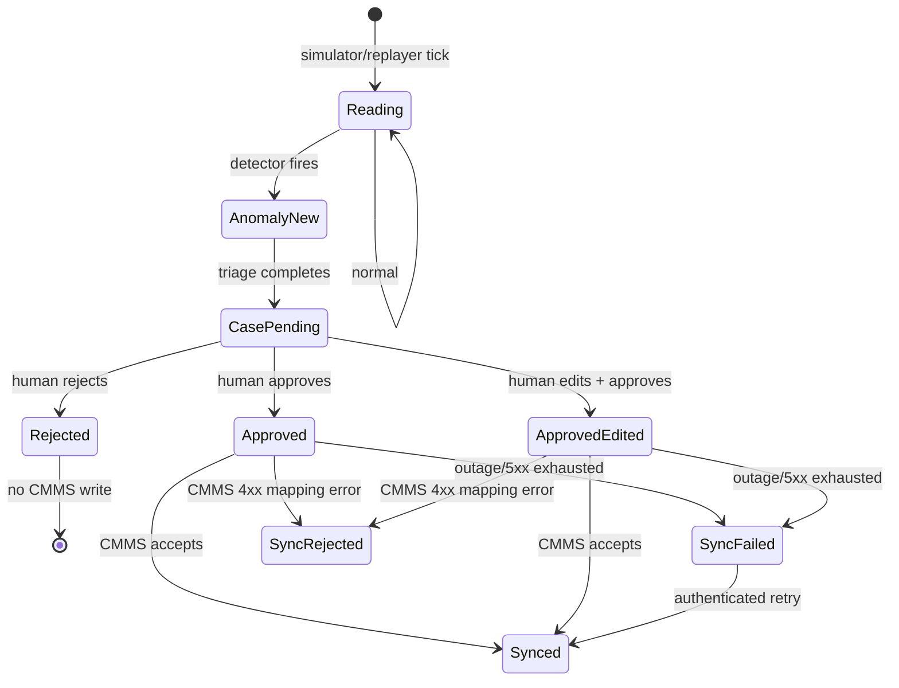

# Code and data-flow reference

This is the deep technical companion to `FDE_DEFENSE_MASTER_GUIDE.md`. It maps
the running application from UI actions to HTTP endpoints, Python/TypeScript
functions, database rows, model/tool decisions, and rendered components. It is
intentionally detailed; do not present it linearly.

Scope: this catalog covers every application function that owns runtime
behavior, data movement, training, evaluation, or a presentation-visible UI
decision. It intentionally excludes CSS declarations, TypeScript type-only
definitions, constants already described beside their consumer, third-party
framework internals, and test helper functions. Those do not change a business
state or explain an architectural decision; the test files remain the exact
reference when a reviewer asks about one assertion.

## Repository and runtime map

| Path | Responsibility | Runtime |
|---|---|---|
| `frontend/app` | Next.js pages and navigation-level UI | Browser/Vercel |
| `frontend/components` | Reusable charts, machine cards, and global chrome | Browser/Vercel |
| `frontend/lib/api.ts` | Typed REST client and session storage | Browser |
| `backend/app/main.py` | FastAPI creation, startup/shutdown, CORS, mounted CMMS | Render/Uvicorn |
| `backend/app/routes.py` | Triage REST API and human/CMMS workflow | Render |
| `backend/app/simulator.py` | Synthetic telemetry and asynchronous triage queue | Render process |
| `backend/app/replay.py` | Recorded SKAB/CWRU episode playback | Render process |
| `backend/app/detector.py` | Deterministic limits, robust-z detection, window context | Render worker thread |
| `backend/app/classifier.py` | Auditable physical-signature classifier | Triage thread |
| `backend/app/ml_classifier.py` | Extra Trees, calibration, and IsolationForest inference | Triage thread |
| `backend/app/agent` | Tool schemas, mock/live model loop, confidence, CMMS adapter | Triage thread / async HTTP |
| `backend/app/priority.py` | Deterministic priority formula | Triage thread |
| `backend/app/models.py` | Triage SQLAlchemy models | SQLite/Postgres |
| `backend/app/cmms` | Mock system-of-record application and foreign schema | Mounted FastAPI app |
| `backend/app/eval` | Trial runner, independent scorers, metrics and report rendering | CLI/GitHub Actions |
| `backend/data` | Episodes, trained artifact, curation/training scripts, provenance | Build/evaluation/runtime reads |
| `render.yaml` | Render build/start/environment defaults | Deployment |
| `.github/workflows` | Keep-warm and evaluation workflows | GitHub Actions |

## Startup and shutdown

`backend/app/main.py::lifespan` is the entry sequence:

1. `init_db()` creates the Postgres schema and currently missing tables.
2. A `SessionLocal` session is opened.
3. `seed_if_empty()` additively inserts missing machines and historical records;
   existing operational data is never overwritten.
4. If `SIM_ENABLED=1`, `simulator_loop()` starts as an asyncio task.
5. `retention_loop()` starts as another task.
6. FastAPI serves the triage router and mounted `/cmms` application.
7. On shutdown, `simulator.running` becomes false and background tasks are
   cancelled.

`CORSMiddleware` currently accepts origins from `ALLOWED_ORIGINS`; production
configuration uses `*` for demo convenience. That is not the final enterprise
policy.

## Complete HTTP endpoint reference

All main endpoints are under `/api`; mock CMMS endpoints are under `/cmms/api`.
GET endpoints are open for demonstration. State-changing main endpoints use
`current_reviewer`, so they require a valid bearer token when
`APP_ACCESS_PASSWORD` is configured.

| Method/path | Function | Auth | Reads | Writes/effect | Important outcomes |
|---|---|---|---|---|---|
| `GET /api/health` | `routes.health` | No | effective LLM mode and simulator state | None | 200 with release id |
| `POST /api/auth/login` | `routes.login` | Password in body | configured password | login audit event; returns signed token | 200 or 401 |
| `GET /api/llm` | `routes.llm_status` | No | environment, runtime override, `llm_calls` ledger | None | mode/model/key/budget |
| `POST /api/llm/mode` | `routes.set_llm_mode` | Yes | budget | process-local override and audit | Pydantic permits live/mock/auto |
| `GET /api/machines` | `routes.list_machines` | No | machines, latest telemetry, pending cases, replay/simulator state | None | batched three-query fleet snapshot |
| `GET /api/machines/{id}/telemetry?n=` | `routes.machine_telemetry` | No | telemetry | None | oldest-to-newest, max 500 |
| `GET /api/cases?status=` | `routes.list_cases` | No | triage cases | None | max 100, priority/id ordering |
| `GET /api/cases/{id}` | `routes.get_case` | No | case and anomaly | None | full evidence/trace or 404 |
| `POST /api/cases/{id}/decision` | `routes.decide_case` | Yes | case | final human decision, audit, possible CMMS sync | 404, 409, or decided case |
| `POST /api/cases/{id}/sync-cmms` | `routes.retry_cmms_sync` | Yes | approved case | retries deferred sync | 409 for invalid/terminal state; 502 if still down |
| `GET /api/audit?machine=&limit=` | `routes.list_audit` | No | audit, anomaly and case ids | None | max 500 filtered rows |
| `GET /api/eval-report` | `routes.eval_report` | No | committed JSON files | None | strips trial detail to reduce payload |
| `POST /api/simulate/inject` | `routes.inject_fault` | Yes | machine/replay metadata | injects synthetic state or moves replay cursor; force flag; audit | 404/422 or cue confirmation |
| `POST /api/simulate/clear/{id}` | `routes.clear_fault` | Yes | None | clears synthetic active fault; audit | 200 |
| `GET /api/simulate/faults` | `routes.list_faults` | No | machines and source state | None | options and active faults |
| `GET /cmms/api/health` | `cmms.service.health` | No | None | None | mock CMMS health |
| `POST /cmms/api/workorders` | `cmms.service.create_work_order` | Idempotency header | existing key | inserts one work order | 201 first time; 200 repeat |
| `GET /cmms/api/workorders` | `cmms.service.list_work_orders` | No | CMMS work orders | None | latest 100 |
| `GET /cmms/api/workorders/{id}` | `cmms.service.get_work_order` | No | one order | None | 200 or 404 |

### Pydantic request models

| Model | Fields and validation |
|---|---|
| `Login` | password; reviewer length 2–60 |
| `LlmMode` | mode regex `live|mock|auto` |
| `Decision` | action `approve|reject|edit`; reviewer; note; optional P1–P4 and action list |
| `Inject` | machine id and fault string; domain code validates availability |
| `WorkOrderIn` | foreign CMMS schema; priority code constrained to 1–4 |

The frontend helper `j<T>()` attaches JSON headers and the stored bearer token,
uses `cache: no-store`, raises a browser event on 401 so the login modal opens,
and throws the API's `detail` string on any non-2xx response.

## Full state transition

Case decisions are final: `decide_case` rejects a second decision with 409.
CMMS synchronization is not the decision transaction. The human decision is
committed first; sync fields record what happened downstream.

## Synthetic telemetry: function-by-function

### Configuration

`BASELINES` gives mean/noise pairs for four simulated machine types.
`SIM_SIGNALS` defines temperature, vibration velocity, pressure, and RPM.
`SIM_LIMITS` defines fixed limits/directions per type. `FAULTS` maps a fault to
the primary metric and per-tick drift.

### `FleetSimulator`

| Function/method | Exact job |
|---|---|
| `__init__` | Creates a seeded RNG and process-local `active_faults`; seed makes runs repeatable |
| `inject_fault` | Validates the fault name and stores `{fault, ticks: 0}` for one machine |
| `clear_fault` | Removes that machine's active synthetic fault |
| `_reading_for` | Draws Gaussian healthy values, applies active drift/cavitation oscillation/friction heat, caps fault age at 25 ticks, rounds values |
| `tick` | Loads simulated machines, possibly injects a random fault, inserts each reading, runs detection, returns anomaly ids |
| `simulator_loop` | Every interval, runs synthetic and replay ticks in threads and puts anomaly ids on a queue without waiting for LLM work |
| nested `triage_worker` | Serially consumes anomaly ids, awaits `triage_anomaly_async`, logs duration/failure, and calls `queue.task_done()` |

Production sets random-fault probability to zero. A manual injection calls
`force_detect` so an already-open demonstration case does not suppress the new
operator-requested event. The detector still emits only one anomaly for the
multi-signal event.

## Recorded replay: function-by-function

### `Episode`

`Episode.__init__` reads a curated CSV, removes `label` and `t_offset_s` from the
visible signal dictionary, converts signals to floats, retains the label only
as evaluation ground truth, and records the first labelled row.

### `DatasetReplayer`

| Function/method | Exact job |
|---|---|
| `__init__` | Holds episode-set cache and per-machine process-local cursor state |
| `_load_set` | Loads descriptor JSON and its episode CSVs once |
| `_state_for` | Initializes a replay machine at episode 0/row 0 with a 30-row warmup |
| `active_fault` | Returns the label under the latest cursor only for the UI fault badge |
| `available_faults` | Returns distinct cueable fault families |
| `available_episodes` | Returns exact physical episode name/fault pairs for evaluation |
| `jump_to_episode` | Selects an exact recording, positions 45 rows before its first label, and resets warmup |
| `jump_to_fault` | Selects the first episode matching a requested fault and delegates to `jump_to_episode` |
| `tick` | Inserts one row for every replay machine, advances/rolls cursor, suppresses detection during warmup, then calls `run_detection` with the hidden label for evaluation storage only |

`JUMP_LEAD_ROWS=WINDOW+15=45`. At a three-second production interval, the
pre-fault lead is roughly 135 seconds. The eval runner calls the same replay
logic without real-time sleeping.

## Detector: every function

| Function | Inputs -> output | Reason it exists |
|---|---|---|
| `force_detect(machine_id)` | id -> process-local set entry | Allows exactly one fresh manually requested event despite open-case cooldown |
| `_severity(value, limit, direction)` | fixed-limit margin -> low/medium/high | Transparent engineering-limit severity |
| `_severity_z(z)` | robust-z magnitude -> severity | Relative-rule severity when no fixed limit exists |
| `robust_z(series, value)` | recent values -> `(value-median)/(1.4826*MAD)` | Robust to an excursion pulling the baseline; stdev fallback for flat MAD |
| `signal_context(keys, history, reading)` | complete window -> per-signal statistics | Gives classifier/agent auditable cross-signal facts |
| `render_context(context, breached_metric)` | statistics -> compact prompt text | Prevents asking the LLM to calculate trends from raw rows |
| `_machine_blocked(db, id)` | DB state -> boolean | Machine-level 10-minute/open-case dedup; a physical event is not one case per signal |
| `_raise_anomaly(...)` | evidence -> anomaly id | Inserts anomaly, commits, and writes system audit event |
| `run_detection(db, machine, reading, label)` | one reading -> zero/one anomaly ids | Runs fixed-limit then sustained robust-z rules; hidden label is stored only for eval |

### Rule behavior

Fixed limit: `((value-limit)*direction)>0`. Severity is low up to 5% beyond,
medium above 5%, and high above 15%.

Relative rule: at least half a window must exist. It excludes the freshest three
values from the baseline, requires `abs(z)>4`, and requires the current plus two
fresh previous readings to exceed the threshold. This reduces single-spike
alerts. `break` after insertion enforces one anomaly/case per reading event.

### Context fields

For every signal: mean, later-minus-earlier drift, volatility as percent of
mean, range, first/last-quarter mean, absolute/percentage delta, least-squares
slope, median, MAD, derivative standard deviation, and sample count.

## Classifier: every function

### Physical-signature layer (`classifier.py`)

| Function | Job |
|---|---|
| `_number` | Safely converts arbitrary values to finite floats |
| `_clamp` | Bounds a score |
| `_strength` | Linear membership from a start to a full-strength threshold |
| `_features` | Maps machine-specific tags to physical roles and normalizes window statistics |
| `_up`, `_down`, `_steady`, `_volatile` | Reusable trend membership functions |
| `_material_up`, `_material_down` | Percentage-delta membership functions |
| `_describe` | Produces human-readable evidence for a role's feature values |
| `classify_signature` | Scores seven fault families, applies separability thresholds, optionally routes to narrow ML, and returns ranking/evidence/layer/OOD metadata |
| `signature_agrees` | Maps root-cause language to the predicted family and returns true/false/unknown |

Clear signatures remain deterministic: bearing wear, overheat, pressure loss,
cavitation, rotor imbalance, suction restriction, and discharge restriction.
The rules publish only when the top score is at least 0.56 and leads the runner
up by at least 0.07. Otherwise they abstain or try the narrow restriction model
when the source/schema is eligible.

### Narrow trained layer (`ml_classifier.py`)

| Function | Job |
|---|---|
| `feature_vector` | Orders 12 statistics for each of the exact six SKAB signal keys into 72 values; returns `None` on schema/data mismatch |
| `load_bundle` | Cached joblib artifact load; returns `None` if absent |
| `classify_restriction` | Runs schema gate, IsolationForest score/threshold, calibrated Extra Trees probability/confidence threshold, then returns suction/discharge or abstention with evidence |

The artifact is not a universal fault classifier. It is a narrow resolver for
the overlapping restriction pair. CWRU's different sensor roster is rejected
before inference, which is schema OOD rather than a fake cross-domain class.

### Training/curation functions

| Script/function | Job |
|---|---|
| `curate_cwru.sha256` | Verifies raw-download identity |
| `matlab_vector` | Extracts drive-end accelerometer vector and RPM from MATLAB |
| `frames` | Converts raw vibration into 0.1-second RMS/kurtosis/crest/RPM feature rows |
| `curate` | Creates checked healthy+fault episode CSVs and descriptor metadata |
| `train_fault_classifier.load_rows` | Reads raw SKAB CSV values and label index |
| `context_at` | Builds detector-compatible context at one window end |
| `detection_context` | Finds the same first detectable context used by production logic |
| `training_windows` | Builds multiple labelled windows while preserving physical experiment group ids |
| `candidates` | Defines candidate Extra Trees hyperparameters |
| `grouped_trigger_oof` | Evaluates trigger contexts with entire experiments held out |
| `window_oof_probabilities` | Gets grouped out-of-fold probabilities for calibration |
| `choose_confidence_threshold` | Targets selective safety on out-of-fold predictions |
| `ood_threshold_oof` | Derives novelty threshold from held-out in-distribution experiments |
| `main` | Fits final model/calibrator/OOD bundle and writes artifact/report |

## Agent and case creation: exact call order

`routes.triage_anomaly_async` opens a fresh DB session inside `asyncio.to_thread`
and calls `run_triage`. That keeps synchronous SQLAlchemy/model HTTP work off the
event loop. The simulator's triage worker awaits this, but telemetry ticks do
not await the worker.

### `triage.py`

| Function | Job |
|---|---|
| `_extract_json` | Accepts direct JSON, fenced JSON, or first embedded object; returns `None` only when no object parses |
| `_dispatch_tool` | Whitelists the three tool names and calls their Python functions |
| `run_triage` | Complete orchestration described below; inserts one pending case and marks anomaly triaged |
| `_summarize` | Stores compact tool-result text in the human trace rather than duplicating full payloads |

`run_triage` performs these steps in order:

1. Load `Anomaly` and `Machine`.
2. Freeze effective mock/live mode and configured model for this case.
3. Parse deterministic signal context.
4. Call `classify_signature`; add prediction to the mock/LLM context.
5. Render system/user messages with anomaly, asset, cross-signal facts, and
   concrete classifier verdict or abstention.
6. Initialize trace with anomaly and signature entries.
7. Run at most eight model turns.
8. Before each paid turn, `reserve_live_call`; if unavailable, reset to mock.
9. On provider error, finish ledger row as failed, record fallback, reset to
   clean mock messages, and continue rather than losing the anomaly.
10. Parse tool arguments strictly. Malformed JSON becomes a structured tool
    error; it is never guessed or silently repaired.
11. Dispatch allowed read-only tools and append results/messages/trace.
12. Parse final structured answer; produce a safe low-confidence answer if
    unstructured or if the eight-turn loop does not converge.
13. If a concrete classifier verdict conflicts with the LLM, retain the
    classifier class, remove unsupported citations, set safe actions, record
    `classification_guard`, and defer verification to the planner.
14. Count recurrence and inspect cited history for safety.
15. Compute formula priority and clamp the model's proposed adjustment.
16. Estimate downtime from the worst leading cited precedent (fallback 4h) and
    multiply by the machine's illustrative hourly cost.
17. Calibrate confidence from precedent, specificity, and signature evidence.
18. Construct evidence and compact list-level breakdown.
19. Insert `TriageCase(status=pending_review)`, mark anomaly `triaged`, commit,
    and audit `case_created`.

### Agent tools (`agent/tools.py`)

| Function | Reads | Returns/behavior |
|---|---|---|
| `get_machine_info` | `machines` | identity, type, location, criticality, signal schema |
| `get_recent_telemetry` | `telemetry`, `machines` | chronological latest N rows plus units |
| `search_maintenance_history` | same-type `maintenance_logs` | term-overlap score plus +2 same-machine boost; latest five ordered by score/date |
| `count_recurrences` | cases joined to anomalies | prior same-machine/same-metric case count for priority |

`TOOL_SCHEMAS` is the JSON-schema contract exposed to both mock and live models.
No tool controls equipment, decides a case, writes a work order, switches mode,
or reads `ground_truth_fault`.

### LLM functions (`agent/llm.py`)

| Function/method | Job |
|---|---|
| `set_runtime_mode` | Sets process-local override; restart returns to safe environment default |
| `runtime_mode` | Returns that override for UI/audit |
| `llm_mode` | Resolves override/environment/key; key alone never authorizes live spending |
| `llm_model` | Reads configurable OpenRouter model, default DeepSeek V4 Flash |
| `chat` | Sends one OpenRouter completion turn with temperature 0.2, tool schemas, 60s timeout, and output cap; returns exact usage |
| `MockLLM.__init__` | Stores anomaly context and scripted step state |
| `MockLLM.chat` | Calls machine, telemetry, history in order; prefers corrective records; returns structured evidence-based answer |
| `_tool_call` | Builds an OpenAI-compatible function-call message for mock parity |

### Calibration (`agent/calibration.py`)

| Function | Job |
|---|---|
| `Calibration.as_dict` | Serializes every confidence factor into evidence |
| `is_non_diagnostic` | Finds noise/transient/inconclusive language |
| `_precedent_factor` | Maps best history score: >=3 ->1.0, 2 ->0.85, 1 ->0.70, 0 ->0.50 |
| `calibrate` | Clamps raw confidence, applies precedent/specificity/signature factors, caps range 0.05–0.95, forces signature abstention <=0.44, and returns abstain/reason |

Specificity is 0.40 for a non-diagnostic answer. A concrete agreeing signature
uses 1.05, conflict 0.65, and signature abstention 0.75. Operational abstention
occurs below 0.45, for non-diagnostic text, conflict, or signature abstention.

### Priority (`priority.py`)

`compute_priority` returns score, components, base priority, and readable rule.
`apply_adjustment` clamps the agent proposal to -1/0/+1 and P1–P4; formula P1
cannot be downgraded.

## Paid request ledger: every function

| Function | Job |
|---|---|
| `daily_cap`, `daily_usd_cap` | Read 12-request/$0.25 defaults from environment |
| `_midnight` | UTC start-of-day boundary for persistent queries |
| `_reset_process_day_if_needed` | Resets secondary evaluation/process counters on a UTC date change |
| `reset_process_budget` | Test/eval reset hook |
| `process_budget_snapshot` | Reports process calls/cost/tokens |
| `live_calls_today`, `live_cost_today` | Query persistent `llm_calls` rows since UTC midnight |
| `budget` | Combines caps, usage, remaining amounts, and reached flag for API/UI |
| `live_allowed` | Tests both persistent call and dollar ceilings |
| `reserve_live_call` | Checks process/persistent limits, increments process count, inserts `started` row before provider call |
| `finish_live_call` | Saves succeeded/failed status, exact tokens/cost/error, and updates process counters |

The production ledger counts provider turns, not cases. A single case normally
uses several calls. Current reservation is sufficient for one triage worker;
multiple workers require a database lock/advisory lock to prevent a race.

## Authentication: every function

| Function | Job |
|---|---|
| `_password` | Reads `APP_ACCESS_PASSWORD` |
| `auth_enabled` | True only when a password is configured |
| `_key` | Derives HMAC key from password |
| `issue_token` | Creates signed reviewer/expiry token |
| `verify_token` | Checks format, HMAC, expiry, and reviewer |
| `current_reviewer` | FastAPI dependency; accepts bearer token or permits demo mutation only when auth is disabled |

With auth enabled, `decide_case` replaces the body reviewer with the signed
session reviewer. This prevents signing a decision as another person. This is
still demo authentication; production needs identity-provider SSO, RBAC,
short-lived tokens, revocation, CSRF/threat review, and least-privilege roles.

## CMMS path: every function

### Adapter (`agent/cmms_adapter.py`)

| Function | Job |
|---|---|
| `failure_mode` | Maps signal/root-cause family to illustrative CAV/OHE/LOO/VIB/OTH code |
| `build_payload` | Translates triage vocabulary into foreign work-order schema and formats narrative |
| `_make_client` | Uses network `CMMS_BASE_URL` when set, otherwise genuine HTTP semantics through ASGI transport |
| `push_work_order` | POSTs with idempotency key; retries transport/5xx three times with exponential backoff; fails fast on 4xx |

### Human route functions

| Function | Job |
|---|---|
| `decide_case` | Enforces pending-only decision, applies optional human edits, commits/audits identity, invokes CMMS only for approvals |
| `_sync_case_to_cmms` | Loads case/machine/anomaly/evidence, builds payload, writes sync result and audit without undoing approval |
| `retry_cmms_sync` | Permits approved retryable cases; returns already-synced idempotently; rejects terminal mapping error |

### Mock CMMS (`cmms/service.py`)

| Function | Job |
|---|---|
| `_next_order_id` | Generates SAP-like 4500... ids for the single-writer mock |
| `health` | Service health response |
| `create_work_order` | Returns existing order on known idempotency key or inserts one validated order |
| `list_work_orders` | Latest 100 work orders |
| `get_work_order` | One order or 404 |
| `CmmsWorkOrder.as_dict` | Foreign model serialization |

### Field mapping

| Internal | CMMS | Rule |
|---|---|---|
| case id | external reference | `triage-case-{id}` |
| machine id | equipment id | direct |
| location | functional location | direct |
| P1/P2/P3/P4 | 1/2/3/4 | inverse-number vocabulary with text |
| constant | notification type | M1 malfunction report |
| anomaly/root cause | damage code | cavitation CAV; thermal OHE; pressure/flow LOO; vibration VIB; else OTH |
| root cause | short text | first 40 characters |
| explanation/citations/exposure/reviewer | long text | formatted narrative |
| reviewer | reported by | AI draft plus named approval |
| case id | HTTP idempotency key | exactly one order per case |

## Database and model reference

### Database functions (`db.py`)

| Function/object | Job |
|---|---|
| URL normalization | Rejects Supabase HTTPS API URL and rewrites Postgres driver URL |
| `engine` | SQLite locally/tests; Postgres pool with pre-ping, size 5, overflow 5, 30-minute recycle |
| `SessionLocal` | Non-expiring SQLAlchemy session factory |
| `init_db` | Creates `pm_triage` schema and missing tables with `create_all` |
| `get_db` | Request-scoped session dependency with guaranteed close |

### Tables/models

| Model/table | Important fields and consumers |
|---|---|
| `Machine/machines` | catalog, criticality, source, dynamic signal/limit/dataset JSON, hourly cost; feed, tools, UI, priority |
| `TelemetryReading/telemetry` | machine, UTC string timestamp, dynamic values JSON; detector, tools, charts |
| `Anomaly/anomalies` | metric/value/threshold/z/severity/description/status/context; case creation; hidden eval label |
| `MaintenanceLog/maintenance_logs` | demo legacy work orders, record type, symptoms/root cause/action/downtime/safety; retrieval and priority |
| `TriageCase/triage_cases` | agent output, evidence, trace, status, reviewer, CMMS state; human queue/system record link |
| `LlmCall/llm_calls` | one provider turn, tokens/cost/error; budget and evidence |
| `AuditEvent/audit_events` | actor/event/entity/detail; accountability timeline |
| `CmmsWorkOrder/cmms_work_orders` | foreign CMMS vocabulary and unique idempotency key |

`utcnow` returns timezone-aware UTC. `Machine.signals`, `Machine.limits`, and
`TelemetryReading.values` parse their JSON fields. `TriageCase.as_dict(false)`
returns list-safe fields; `full=true` additionally returns evidence and trace.
`audit()` inserts and commits one attributed business event.

## Retention and seeding

| Function | Job |
|---|---|
| `seed._skab_machine` | Builds PMP-03 catalog row from episode descriptor |
| `seed._cwru_machine` | Builds BRG-01 catalog row and provenance |
| `seed_if_empty` | Additively inserts missing eight simulated machines, replay machines, and history rows without overwriting existing data |
| `prune_telemetry` | Deletes only telemetry older than configured 24h default |
| `retention_loop` | Runs prune in a thread every 900s and logs without killing service on error |

Cases, anomalies, audit, work orders, and LLM ledger are not pruned. A real
retention policy must account for customer regulation and partition/archive
volume rather than keeping every non-telemetry row forever.

## Frontend page and function reference

### Shared API/session (`frontend/lib/api.ts`)

| Function/value | Job |
|---|---|
| `API` | Build-time backend base URL |
| `getSession` | Safely parses reviewer/token from localStorage |
| `setSession` | Stores/removes session and dispatches auth-changed event |
| private `j<T>` | Authenticated no-cache JSON fetch, 401 event, typed result/error |
| `getHealth`, `getLlm`, `setLlmMode`, `login` | Global status/auth controls |
| `getMachines`, `getTelemetry` | Fleet/machine data |
| `getCases`, `getCase`, `decideCase`, `retryCmmsSync` | Triage/human workflow |
| `getFaults`, `injectFault` | Demo scenario control |
| `getAudit`, `getEvalReport`, `getWorkOrders` | Accountability/evidence/system-of-record views |

TypeScript types mirror the dynamic signal schema, cases, work orders,
signature evidence, evaluation reports, and budget. These are compile-time
checks, not runtime validation of server responses; the backend Pydantic/models
remain the runtime authority.

### Global shell/components

| Function/component | Calls/state | What it renders |
|---|---|---|
| `RootLayout` | none | HTML shell, global CSS, `Chrome`, page content |
| `Chrome` | health/LLM every 8s; session events | navigation, wake status, free/live call/cost pill, sign-in |
| `toggleLlm` | `setLlmMode` after paid confirmation | authenticated mock/live switch |
| `LoginModal` / `submit` | `login`, `setSession` | reviewer/password form and error state |
| `MachineCard` | telemetry every 4s | latest rounded values, real/fault/case badges, sparklines |
| `Sparkline` | no API | small SVG line normalized to local min/max; visual only |
| `AxisChart` | no API | larger chart with axes, unit, hover/last-value tooltip |

### Pages

| Function/component | Calls/polling | Responsibility |
|---|---|---|
| `FleetPage` | machines/cases 3.5s; faults once | fleet grid, cold-start retry, injection/cue message |
| nested `inject` | `injectFault`, refresh | authenticated scenario request; reports server timing/status |
| `MachinePage` | machines, telemetry, cases, work orders, audit every 5s | asset-centered join across operational records |
| `CaseRow` | no API | compact case link on machine page |
| `CasesInner` | cases every 5s | client filters by machine/status/priority and renders queue cards |
| `CasesPage` | Suspense wrapper | supports search parameters safely |
| `CasePage` | one case, refresh after state change | complete evidence/decision screen |
| `TraceBubble` | no API | maps trace steps to detector/tool/warning/system bubbles |
| `FinalBubble` | no API | root cause, explanation, actions, calibrated confidence/abstention |
| `DecisionBubble` | no API | final human identity/time/note and work order |
| `SignalTable` | no API | deterministic context shown to classifier/agent |
| `SignaturePanel` | no API | prediction/rank/confidence/OOD/agent agreement evidence |
| `CmmsPanel` / `retry` | `retryCmmsSync` | synced/failed/rejected downstream state and safe retry |
| `DecisionBox` / `decide` | `decideCase` | approve/edit/reject form; refreshes case |
| `CmmsInner` | work orders every 6s | foreign-schema work orders and machine filter |
| `CmmsPage` | Suspense wrapper | search-param safe CMMS screen |
| `AuditInner` | audit every 6s | local-time attributed state transitions and machine filter |
| `actorClass`, `localTimestamp` | no API | audit color classification and timezone display |
| `AuditPage` | Suspense wrapper | search-param safe audit screen |
| `EvalPage` | static reports immediately; backend override once | dataset tabs, summaries, comparisons, matrices, calibration, cost |
| `hasReports` | report object -> bool | prevents an empty live response from replacing bundled evidence |
| `reportTimestamp` | ISO -> UTC text | states report generation time unambiguously |
| `Stat`, `Panel`, `Explain` | no API | evaluation presentation components |
| `PlainResult` | percentages -> integer counts | converts abstract percentages to 18/24, 7/8, 6/6 language |
| `Row` | mock/live values | delta and good/warn styling; percentage points for percentages |
| `Confusion` | nested count map | truth rows, predicted columns, diagonal/off-diagonal heat cells |

## Evaluation: function-by-function

### Runner (`eval/runner.py`)

| Function/method | Job |
|---|---|
| `TrialResult.as_dict` | Serializes one trial and derived scorer fields |
| `_fresh_db` | Creates isolated SQLite DB and seed per trial to prevent state leakage |
| `eligible_machines` | Chooses machine types that support a synthetic fault |
| `_record_classifier` | Captures case signature prediction/layer/OOD into result |
| `run_trial` | Executes a synthetic case through actual simulator reading, detector, and `run_triage`; independent text/citation scoring |
| `run_replay_trial` | Replays an exact recorded episode through actual replayer/detector/triage and records label-window timing |
| `replay_faults` | Lists replay fault labels |
| `replay_episodes` | Lists physical machine/episode/fault tuples |
| `run_replay_suite` | Runs a deterministic plan over physical episodes; larger n repeats evidence |
| `build_plan` | Balanced seeded synthetic machine/fault plan |
| `run_suite` | Executes synthetic plan with progress callback |

### Metrics (`eval/metrics.py`)

| Function | Job |
|---|---|
| `_pct` | Safe rounded percentage |
| `summarize` | Builds all detection, accuracy, coverage, abstention, per-class, confusion, calibration, latency fields |
| `_calibration` | Groups cases into confidence buckets and compares stated vs actual |
| `_ece` | Weighted mean absolute confidence/accuracy gap |
| `format_report` | Plain console report for workflow logs/PRs |

### Independent taxonomy scorer (`eval/taxonomy.py`)

| Function | Job |
|---|---|
| `score_text` | Weighted known fault markers in free text |
| `named_classes` | Finds distinctively named families to expose hedging |
| `classify_text` | Chooses top-1 class; resolves ties by earliest marker; returns hedging flag |
| `_earliest_marker_pos` | Tie-break helper |
| `classify_citations` | Independently maps the first recognized cited work order to a class |
| `mentions_class` | Hit@any: true class anywhere in text |
| `is_abstention` | Independently detects explicit noise/transient/unknown non-answer language |

### Command-line wrapper (`eval/__main__.py`)

| Function | Job |
|---|---|
| `_run` | Selects mock/live mode, validates the paid key, snapshots paid usage, runs the synthetic or replay suite, summarizes results, attaches per-trial evidence, and calculates replay detection timing |
| nested `progress` | Prints `.` for a correct text classification, `x` for a scored miss, and `!` for a trial error unless quiet mode is enabled |
| `main` | Parses CLI options, runs mock/live/both, prints the comparison, optionally merges untouched modes from an existing report, stamps pipeline metadata, and writes JSON |

`--mode both` uses the same seeded synthetic plan for a fair scripted-versus-live
comparison. `--data replay` uses the recorded episode plan. `--merge-existing`
does not blend trials: it preserves report modes that were not rerun and
replaces the selected mode as a complete unit.

The evaluator uses production detector, classifier, agent, tools, calibration,
priority, and case persistence. Ground truth is never exposed to agent tools.
Text and citation scorers share no decision code with the agent/classifier.

## Test-suite map: 105 backend tests

| File | Count | Coverage |
|---|---:|---|
| `test_answer_parsing.py` | 9 | direct/fenced/prose JSON and malformed outputs |
| `test_auth_and_budget.py` | 9 | signed identity, auth enforcement, request/cost ledger and caps |
| `test_calibration.py` | 9 | evidence factors, threshold, conflict and abstention |
| `test_classifier.py` | 5 | physical signatures and ambiguity |
| `test_cmms_adapter.py` | 5 | field translation, retry, idempotent HTTP behavior |
| `test_cmms_flow.py` | 6 | human decision to sync/failure/retry/rejection |
| `test_detector.py` | 12 | fixed/relative rules, context, cooldown and one-event dedup |
| `test_eval_runner.py` | 20 | plans, replay, isolation, labels and report integration |
| `test_eval_taxonomy.py` | 14 | text/citation classification, hedging, scorer regression |
| `test_simulator_loop.py` | 1 | slow triage cannot pause telemetry ticks |
| `test_triage_flow.py` | 8 | tools, case persistence, classifier guard, live fallback |

The Next.js production build performs TypeScript checking and static/dynamic
route compilation. There is not yet a committed browser E2E suite; that is an
honest SDLC gap.

## Worked example: synthetic CNC vibration event

Assume CNC-01 has criticality 5, vibration limit 5.5 mm/s, current vibration
7.2, no recurrence, no safety precedent, and a specific matching diagnosis.

1. `FleetSimulator._reading_for` produces the row and `tick` commits it.
2. `run_detection` checks `(7.2-5.5)*(+1)>0`.
3. Margin is `(7.2-5.5)/5.5=30.9%`, so `_severity` returns high.
4. `_raise_anomaly` inserts one anomaly plus `anomaly_detected` audit.
5. The triage queue calls `triage_anomaly_async` -> `run_triage`.
6. `classify_signature` sees rising vibration plus other roles and returns a
   class or explicit ambiguity with evidence.
7. Mock/live calls the three read-only tools and cites matching history.
8. Priority: criticality 5 + high severity 6 + recurrence 0 + safety 0 = 11,
   therefore base P2.
9. If raw confidence is 0.75, best precedent score >=3, specific language, and
   a confident agreeing signature: `0.75*1.0*1.0*1.05=0.7875`, displayed 0.79,
   above the 0.45 abstention threshold.
10. The case is inserted pending review. No work order exists yet.
11. Human approval maps P2 -> CMMS code 2-High; vibration -> VIB; case id ->
    external reference and idempotency key.
12. CMMS returns one 4500... order and audit records `work_order_created`.

This example separates three numbers commonly confused in interviews: anomaly
severity, calibrated diagnosis confidence, and business priority.

## Worked example: CWRU bearing replay

BRG-01 has recorded features: drive-end RMS g, kurtosis ratio, crest-factor
ratio, and RPM. Healthy display values such as 0.074 g, 2.78, 3.36, and 1,796
RPM are rounded only in the UI; stored/detector values retain precision.

1. `jump_to_fault` selects a CWRU episode and positions 45 healthy frames before
   its labelled faulty section.
2. `tick` commits one frame every three seconds; the first 30 refill the detector
   baseline after the artificial recording jump.
3. A sustained excursion or large relative change creates one anomaly. During
   the investigated production incident an RMS event reached about 0.292 g
   against a roughly 0.072 rolling baseline with z about 115.87.
4. Context contains all four signals. The fixed version stops after the first
   event; kurtosis/crest/RPM remain evidence rather than three extra cases.
5. CWRU's schema does not match the narrow six-signal SKAB model, so that model
   does not pretend to generalize. Physical rules can identify the coarse
   bearing-wear family; otherwise the system abstains.
6. Ground-truth inner/ball/outer labels remain evaluation-only and map to the
   application's coarser `bearing_wear` taxonomy.

The event demonstrates real recorded signal ingestion and schema-OOD behavior;
it does not prove natural run-to-failure prediction.

## File path for every presentation claim

| Claim | Primary implementation/evidence |
|---|---|
| No machine control | `agent/tools.py` schemas; `triage.py` system prompt |
| Deterministic detection | `detector.py` |
| One event/one case | `detector._machine_blocked`, loop `break`, detector tests |
| Telemetry continues during LLM | `simulator.simulator_loop`, `triage_worker`, loop test |
| Narrow ML/OOD | `ml_classifier.py`, model artifact/report, `ML_EXPERIMENT.md` |
| LLM cannot override classifier | `triage.run_triage` classification guard |
| Confidence abstains | `agent/calibration.py` |
| Priority transparent | `priority.py` |
| Human mandatory | `routes.decide_case`; all new cases pending review |
| CMMS integration | `agent/cmms_adapter.py`, `cmms/service.py`, flow tests |
| Cost guard | `llm_budget.py`, `agent/llm.py`, auth/budget tests |
| Audit | `audit.py`, route decision/sync/injection calls |
| Eval uses production pipeline | `eval/runner.py` |
| Current numbers | committed JSON reports and `EVALUATION_GUIDE.md` |

When challenged, start from the business invariant, name the owning function,
describe its database effect, then state the production limitation. That is a
stronger defense than reciting implementation syntax.
